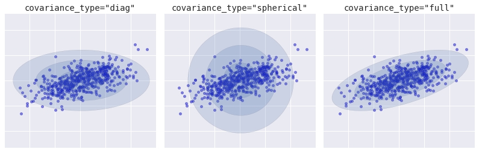

# Benchmarking `importnb`

Benchmarks for `importnb` explore the ability to import existing notebooks as modules. 


```python
    from importnb import Parameterize, Notebook
    with Notebook():
        import benchmark
    
```


```python
    timeout = 10
    benchmarker = __import__('functools').partial(Parameterize(benchmark), timeout=timeout)
```


```python
    with __import__('io').StringIO(benchmark.__doc__) as s:
        projects = list(__import__('yaml').safe_load_all(s))[-1]
```


```python
    benchmarked = {
        project['repo']: print(f"""{project}\n{'='*10}""") or benchmarker(**project)
        for project in reversed(projects)
    }
```

    {'repo': 'https://github.com/AllenDowney/ThinkDSP', 'notebooks': 'ThinkDSP/code'}
    ==========
    🏆 ThinkDSP/code/cacophony.ipynb
    🏆 ThinkDSP/code/chap01.ipynb
    🏆 ThinkDSP/code/chap01soln.ipynb
    🏆 ThinkDSP/code/chap02.ipynb
    🏆 ThinkDSP/code/chap02soln.ipynb
    🏆 ThinkDSP/code/chap03.ipynb
    🏆 ThinkDSP/code/chap03soln.ipynb
    🏆 ThinkDSP/code/chap04.ipynb
    😩 ThinkDSP/code/chap04soln.ipynb
    🏆 ThinkDSP/code/chap05.ipynb
    😩 ThinkDSP/code/chap05soln.ipynb
    🏆 ThinkDSP/code/chap06.ipynb
    😩 ThinkDSP/code/chap06soln.ipynb
    😩 ThinkDSP/code/chap06starter.ipynb
    🏆 ThinkDSP/code/chap07.ipynb
    🏆 ThinkDSP/code/chap07soln.ipynb
    🏆 ThinkDSP/code/chap08.ipynb
    🏆 ThinkDSP/code/chap08soln.ipynb
    🏆 ThinkDSP/code/chap09.ipynb
    🏆 ThinkDSP/code/chap09soln.ipynb
    😩 ThinkDSP/code/chap10.ipynb
    🏆 ThinkDSP/code/chap10preview.ipynb
    🏆 ThinkDSP/code/chap10soln.ipynb
    😩 ThinkDSP/code/chap11.ipynb
    😩 ThinkDSP/code/chap11soln.ipynb
    😩 ThinkDSP/code/diff_int.ipynb
    🏆 ThinkDSP/code/phase.ipynb
    🏆 ThinkDSP/code/saxophone.ipynb
    🏆 ThinkDSP/code/scipy2015_demo.ipynb
    😩 ThinkDSP/code/voss.ipynb
    70.0% of the Python Data Science Handbook notebooks loaded with a import threshold of 10.000000 seconds
    {'repo': 'https://www.github.com/jakevdp/PythonDataScienceHandbook', 'notebooks': 'PythonDataScienceHandbook/notebooks/'}
    ==========
    🏆 PythonDataScienceHandbook/notebooks/00.00-Preface.ipynb
    🏆 PythonDataScienceHandbook/notebooks/01.00-IPython-Beyond-Normal-Python.ipynb
    🏆 PythonDataScienceHandbook/notebooks/01.01-Help-And-Documentation.ipynb
    🏆 PythonDataScienceHandbook/notebooks/01.02-Shell-Keyboard-Shortcuts.ipynb
    🏆 PythonDataScienceHandbook/notebooks/01.03-Magic-Commands.ipynb
    🏆 PythonDataScienceHandbook/notebooks/01.04-Input-Output-History.ipynb
    🏆 PythonDataScienceHandbook/notebooks/01.05-IPython-And-Shell-Commands.ipynb
    😩 PythonDataScienceHandbook/notebooks/01.06-Errors-and-Debugging.ipynb
    😩 PythonDataScienceHandbook/notebooks/01.07-Timing-and-Profiling.ipynb
    🏆 PythonDataScienceHandbook/notebooks/01.08-More-IPython-Resources.ipynb
    🏆 PythonDataScienceHandbook/notebooks/02.00-Introduction-to-NumPy.ipynb
    🏆 PythonDataScienceHandbook/notebooks/02.01-Understanding-Data-Types.ipynb
    🏆 PythonDataScienceHandbook/notebooks/02.02-The-Basics-Of-NumPy-Arrays.ipynb
    😩 PythonDataScienceHandbook/notebooks/02.03-Computation-on-arrays-ufuncs.ipynb
    😩 PythonDataScienceHandbook/notebooks/02.04-Computation-on-arrays-aggregates.ipynb
    😩 PythonDataScienceHandbook/notebooks/02.05-Computation-on-arrays-broadcasting.ipynb
    😩 PythonDataScienceHandbook/notebooks/02.06-Boolean-Arrays-and-Masks.ipynb
    😩 PythonDataScienceHandbook/notebooks/02.07-Fancy-Indexing.ipynb
    🏆 PythonDataScienceHandbook/notebooks/02.08-Sorting.ipynb
    😩 PythonDataScienceHandbook/notebooks/02.09-Structured-Data-NumPy.ipynb
    🏆 PythonDataScienceHandbook/notebooks/03.00-Introduction-to-Pandas.ipynb
    😩 PythonDataScienceHandbook/notebooks/03.01-Introducing-Pandas-Objects.ipynb
    🏆 PythonDataScienceHandbook/notebooks/03.02-Data-Indexing-and-Selection.ipynb
    🏆 PythonDataScienceHandbook/notebooks/03.03-Operations-in-Pandas.ipynb
    😩 PythonDataScienceHandbook/notebooks/03.04-Missing-Values.ipynb
    😩 PythonDataScienceHandbook/notebooks/03.05-Hierarchical-Indexing.ipynb
    🏆 PythonDataScienceHandbook/notebooks/03.06-Concat-And-Append.ipynb
    😩 PythonDataScienceHandbook/notebooks/03.07-Merge-and-Join.ipynb
    🏆 PythonDataScienceHandbook/notebooks/03.08-Aggregation-and-Grouping.ipynb
    😩 PythonDataScienceHandbook/notebooks/03.09-Pivot-Tables.ipynb
    😩 PythonDataScienceHandbook/notebooks/03.10-Working-With-Strings.ipynb
    😩 PythonDataScienceHandbook/notebooks/03.11-Working-with-Time-Series.ipynb
    😩 PythonDataScienceHandbook/notebooks/03.12-Performance-Eval-and-Query.ipynb
    🏆 PythonDataScienceHandbook/notebooks/03.13-Further-Resources.ipynb
    🏆 PythonDataScienceHandbook/notebooks/04.00-Introduction-To-Matplotlib.ipynb
    🏆 PythonDataScienceHandbook/notebooks/04.01-Simple-Line-Plots.ipynb
    🏆 PythonDataScienceHandbook/notebooks/04.02-Simple-Scatter-Plots.ipynb
    🏆 PythonDataScienceHandbook/notebooks/04.03-Errorbars.ipynb
    🏆 PythonDataScienceHandbook/notebooks/04.04-Density-and-Contour-Plots.ipynb
    🏆 PythonDataScienceHandbook/notebooks/04.05-Histograms-and-Binnings.ipynb
    😩 PythonDataScienceHandbook/notebooks/04.06-Customizing-Legends.ipynb
    🏆 PythonDataScienceHandbook/notebooks/04.07-Customizing-Colorbars.ipynb
    🏆 PythonDataScienceHandbook/notebooks/04.08-Multiple-Subplots.ipynb
    😩 PythonDataScienceHandbook/notebooks/04.09-Text-and-Annotation.ipynb
    🏆 PythonDataScienceHandbook/notebooks/04.10-Customizing-Ticks.ipynb
    🏆 PythonDataScienceHandbook/notebooks/04.11-Settings-and-Stylesheets.ipynb
    🏆 PythonDataScienceHandbook/notebooks/04.12-Three-Dimensional-Plotting.ipynb
    😩 PythonDataScienceHandbook/notebooks/04.13-Geographic-Data-With-Basemap.ipynb
    😩 PythonDataScienceHandbook/notebooks/04.14-Visualization-With-Seaborn.ipynb
    🏆 PythonDataScienceHandbook/notebooks/04.15-Further-Resources.ipynb
    🏆 PythonDataScienceHandbook/notebooks/05.00-Machine-Learning.ipynb
    🏆 PythonDataScienceHandbook/notebooks/05.01-What-Is-Machine-Learning.ipynb
    🏆 PythonDataScienceHandbook/notebooks/05.02-Introducing-Scikit-Learn.ipynb
    🏆 PythonDataScienceHandbook/notebooks/05.03-Hyperparameters-and-Model-Validation.ipynb
    🏆 PythonDataScienceHandbook/notebooks/05.04-Feature-Engineering.ipynb
    🏆 PythonDataScienceHandbook/notebooks/05.05-Naive-Bayes.ipynb
    😩 PythonDataScienceHandbook/notebooks/05.06-Linear-Regression.ipynb


    ---------------------------------------------------------------------------

    TimeoutError                              Traceback (most recent call last)

    ~/importnb/benchmarks/PythonDataScienceHandbook/notebooks/03.12-Performance-Eval-and-Query.ipynb in <module>()


    ~/anaconda/envs/p6/lib/python3.6/site-packages/sklearn/grid_search.py in fit(self, X, y)
        836 
        837         """
    --> 838         return self._fit(X, y, ParameterGrid(self.param_grid))
        839 
        840 


    ~/anaconda/envs/p6/lib/python3.6/site-packages/sklearn/grid_search.py in _fit(self, X, y, parameter_iterable)
        572                                     self.fit_params, return_parameters=True,
        573                                     error_score=self.error_score)
    --> 574                 for parameters in parameter_iterable
        575                 for train, test in cv)
        576 


    ~/anaconda/envs/p6/lib/python3.6/site-packages/sklearn/externals/joblib/parallel.py in __call__(self, iterable)
        777             # was dispatched. In particular this covers the edge
        778             # case of Parallel used with an exhausted iterator.
    --> 779             while self.dispatch_one_batch(iterator):
        780                 self._iterating = True
        781             else:


    ~/anaconda/envs/p6/lib/python3.6/site-packages/sklearn/externals/joblib/parallel.py in dispatch_one_batch(self, iterator)
        623                 return False
        624             else:
    --> 625                 self._dispatch(tasks)
        626                 return True
        627 


    ~/anaconda/envs/p6/lib/python3.6/site-packages/sklearn/externals/joblib/parallel.py in _dispatch(self, batch)
        586         dispatch_timestamp = time.time()
        587         cb = BatchCompletionCallBack(dispatch_timestamp, len(batch), self)
    --> 588         job = self._backend.apply_async(batch, callback=cb)
        589         self._jobs.append(job)
        590 


    ~/anaconda/envs/p6/lib/python3.6/site-packages/sklearn/externals/joblib/_parallel_backends.py in apply_async(self, func, callback)
        109     def apply_async(self, func, callback=None):
        110         """Schedule a func to be run"""
    --> 111         result = ImmediateResult(func)
        112         if callback:
        113             callback(result)


    ~/anaconda/envs/p6/lib/python3.6/site-packages/sklearn/externals/joblib/_parallel_backends.py in __init__(self, batch)
        330         # Don't delay the application, to avoid keeping the input
        331         # arguments in memory
    --> 332         self.results = batch()
        333 
        334     def get(self):


    ~/anaconda/envs/p6/lib/python3.6/site-packages/sklearn/externals/joblib/parallel.py in __call__(self)
        129 
        130     def __call__(self):
    --> 131         return [func(*args, **kwargs) for func, args, kwargs in self.items]
        132 
        133     def __len__(self):


    ~/anaconda/envs/p6/lib/python3.6/site-packages/sklearn/externals/joblib/parallel.py in <listcomp>(.0)
        129 
        130     def __call__(self):
    --> 131         return [func(*args, **kwargs) for func, args, kwargs in self.items]
        132 
        133     def __len__(self):


    ~/anaconda/envs/p6/lib/python3.6/site-packages/sklearn/cross_validation.py in _fit_and_score(estimator, X, y, scorer, train, test, verbose, parameters, fit_params, return_train_score, return_parameters, error_score)
       1673             estimator.fit(X_train, **fit_params)
       1674         else:
    -> 1675             estimator.fit(X_train, y_train, **fit_params)
       1676 
       1677     except Exception as e:


    ~/anaconda/envs/p6/lib/python3.6/site-packages/sklearn/pipeline.py in fit(self, X, y, **fit_params)
        248         Xt, fit_params = self._fit(X, y, **fit_params)
        249         if self._final_estimator is not None:
    --> 250             self._final_estimator.fit(Xt, y, **fit_params)
        251         return self
        252 


    ~/anaconda/envs/p6/lib/python3.6/site-packages/sklearn/svm/base.py in fit(self, X, y, sample_weight)
        185 
        186         seed = rnd.randint(np.iinfo('i').max)
    --> 187         fit(X, y, sample_weight, solver_type, kernel, random_seed=seed)
        188         # see comment on the other call to np.iinfo in this file
        189 


    ~/anaconda/envs/p6/lib/python3.6/site-packages/sklearn/svm/base.py in _dense_fit(self, X, y, sample_weight, solver_type, kernel, random_seed)
        252                 cache_size=self.cache_size, coef0=self.coef0,
        253                 gamma=self._gamma, epsilon=self.epsilon,
    --> 254                 max_iter=self.max_iter, random_seed=random_seed)
        255 
        256         self._warn_from_fit_status()


    ~/anaconda/envs/p6/lib/python3.6/site-packages/timeout_decorator/timeout_decorator.py in handler(signum, frame)
         70         if use_signals:
         71             def handler(signum, frame):
    ---> 72                 _raise_exception(timeout_exception, exception_message)
         73 
         74             @wraps(function)


    ~/anaconda/envs/p6/lib/python3.6/site-packages/timeout_decorator/timeout_decorator.py in _raise_exception(exception, exception_message)
         43     """
         44     if exception_message is None:
    ---> 45         raise exception()
         46     else:
         47         raise exception(value=exception_message)


    TimeoutError: 'Timed Out'


    😩 PythonDataScienceHandbook/notebooks/05.07-Support-Vector-Machines.ipynb
    🏆 PythonDataScienceHandbook/notebooks/05.08-Random-Forests.ipynb
    🏆 PythonDataScienceHandbook/notebooks/05.09-Principal-Component-Analysis.ipynb
    😩 PythonDataScienceHandbook/notebooks/05.10-Manifold-Learning.ipynb
    😩 PythonDataScienceHandbook/notebooks/05.11-K-Means.ipynb
    😩 PythonDataScienceHandbook/notebooks/05.12-Gaussian-Mixtures.ipynb
    😩 PythonDataScienceHandbook/notebooks/05.13-Kernel-Density-Estimation.ipynb
    😩 PythonDataScienceHandbook/notebooks/05.14-Image-Features.ipynb
    🏆 PythonDataScienceHandbook/notebooks/05.15-Learning-More.ipynb
    🏆 PythonDataScienceHandbook/notebooks/06.00-Figure-Code.ipynb
    🏆 PythonDataScienceHandbook/notebooks/Index.ipynb
    60.3% of the Python Data Science Handbook notebooks loaded with a import threshold of 10.000000 seconds





```python
    if __name__ == '__main__':
        !jupyter nbconvert --to markdown readme.ipynb
```
