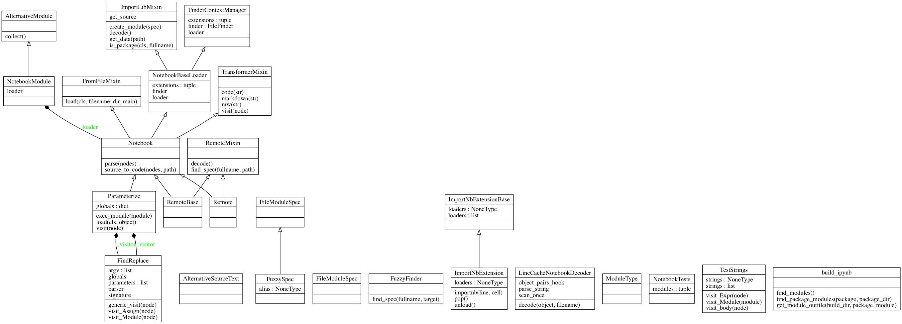

__importnb__ imports notebooks as modules.  Notebooks are reusable as tests, source code, importable modules, and command line utilities.

[](https://mybinder.org/v2/gh/deathbeds/importnb/master?urlpath=lab/tree/readme.ipynb)[](https://travis-ci.org/deathbeds/importnb)[](https://badge.fury.io/py/importnb)[
](https://anaconda.org/conda-forge/importnb)[
](https://github.com/deathbeds/importnb/tree/master/src/importnb)

##### Installation

    pip install importnb
    
---

    conda install -c conda-forge importnb

---

# `importnb` for testing

After `importnb` is installed, [pytest](https://pytest.readthedocs.io/) will discover and import notebooks as tests.

    pytest readme.ipynb

[`importnb`]() imports notebooks as python modules, it does not compare outputs like [`nbval`]()

`importnb` can run unittests and doctests against notebook modules. 

    ipython -m importnb.test readme
    
> `importnb` interprets the first markdown cell as a docstring.  This is a nice place to put [doctests](https://docs.python.org/3/library/doctest.html) to improve the reusability of a notebook.

> Notebooks are often used as informal tests, now they can be formally tested with [pytest plugins](https://docs.pytest.org/en/latest/plugins.html)


---

# `importnb` for the commmand line

`importnb` can run notebooks as command line scripts.  Any literal variable in the notebook, may be applied as a parameter from the command line.

    ipython -m importnb -- readme.ipynb --foo "A new value"

---

# `importnb` for Python and IPython


It is suggested to execute `importnb-install` to make sure that notebooks for each IPython session.

> Restart and run all or it didn't happen.

`importnb` excels in an interactive environment and if a notebook will __Restart and Run All__ then it may reused as python code. The `Notebook` context manager will allow notebooks _with valid names_ to import with Python.

    >>> from importnb import Notebook

### For brevity


```python
    with __import__('importnb').Notebook(): 
        import readme
```

> [`importnb.loader`](src/notebooks/loader.ipynb) will find notebooks available anywhere along the [`sys.path`](https://docs.python.org/2/library/sys.html#sys.path).

#### or explicity 


```python
    from importnb import Notebook
    with Notebook(): 
        import readme
```


```python
    foo = 42
    import readme
    assert readme.foo is 42
    assert readme.__file__.endswith('.ipynb')
```

### Modules may be reloaded 

The context manager is required to `reload` a module.


```python
    from importlib import reload
    with Notebook(): __name__ == '__main__' and reload(readme)
```

### Lazy imports

The `lazy` option will delay the evaluation of a module until one of its attributes are accessed the first time.


```python
    with Notebook(lazy=True):
        import readme
```

### Fuzzy File Names


```python
    if __name__ == '__main__':
        with Notebook():
            import __a_me
            
        assert __a_me.__file__ == readme.__file__
```

Python does not provide a way to import file names starting with numbers of contains special characters.  `importnb` installs a fuzzy import logic to import files containing these edge cases.

    import __2018__6_01_A_Blog_Post
    
will find the first file matching `*2018*6?01?A?Blog?Post`.  Importing `Untitled314519.ipynb` could be supported with the query below.

    import __314519

### Docstring

The first markdown cell will become the module docstring.


```python
    if __name__ == '__main__':
        print(readme.__doc__.splitlines()[0])
```

    __importnb__ imports notebooks as modules.  Notebooks are reusable as tests, source code, importable modules, and command line utilities.
    

Meaning non-code blocks can be executeb by [doctest]().


```python
    if __name__ == '__main__':
        __import__('doctest').testmod(readme)
```

# Import notebooks from files

Notebook names may not be valid Python paths.  In this case, use `Notebook.from_filename`.

       Notebook.from_filename('readme.ipynb')
       
Import under the `__main__` context.
       
       Notebook('__main__').from_filename('readme.ipynb')

# Parameterize Notebooks

Literal ast statements are converted to notebooks parameters.

In `readme`, `foo` is a parameter because it may be evaluated with ast.literal_val


```python
    if __name__ == '__main__':
        from importnb import Parameterize
        f = Parameterize.load(readme.__file__)
```

The parameterized module is a callable that evaluates with different literal statements.


```python
    if __name__ == '__main__': 
        assert callable(f)
        f.__signature__
```

    assert f().foo == 42
    assert f(foo='importnb').foo == 'importnb'

# Run Notebooks from the command line

Run any notebook from the command line with importnb.  Any parameterized expressions are available as parameters on the command line.

    

    !ipython -m importnb -- readme.ipynb --foo "The new value"

## Integrations


### IPython

#### [IPython Extension](src/notebooks/loader.ipynb#IPython-Extensions)

Avoid the use of the context manager using loading importnb as IPython extension.

    %load_ext importnb
    
`%unload_ext importnb` will unload the extension.

#### Default Extension

`importnb` may allow notebooks to import by default with 

    !importnb-install
    

> If you'd like to play with source code on binder then you must execute the command above.  Toggle the markdown cell to a code cell and run it.

This extension will install a script into the default IPython profile startup that is called each time an IPython session is created.  

Uninstall the extension with `importnb-install`.

##### Run a notebook as a module

When the default extension is loaded any notebook can be run from the command line. After the `importnb` extension is created notebooks can be execute from the command line.

    ipython -m readme
    
In the command line context, `__file__ == sys.arv[0] and __name__ == '__main__'` .
    
> See the [deploy step in the travis build](https://github.com/deathbeds/importnb/blob/docs/.travis.yml#L19).

##### Parameterizable IPython commands

Installing the IPython extension allows notebooks to be computed from the command.  The notebooks are parameterizable from the command line.

    ipython -m readme -- --help

### py.test

`importnb` installs a pytest plugin when it is setup.  Any notebook obeying the py.test discovery conventions can be used in to pytest.  _This is great because notebooks are generally your first test._

    !ipython -m pytest -- src 
    
Will find all the test notebooks and configurations as pytest would any Python file.

### Setup

To package notebooks add `recursive-include package_name *.ipynb`

## Developer

* [Source Notebooks](src/notebooks/)
* [Transpiled Python Source](src/importnb/)
* [Tests](src/importnb/tests)

### Format and test the Source Code


```python
    if __name__ == '__main__':
        if globals().get('__file__', None) == __import__('sys').argv[0]:
            print(foo, __import__('sys').argv)
        else:
            from subprocess import call
            !ipython -m pytest
            """Formatting"""
            from pathlib import Path
            from importnb.utils.export import export
            root = 'src/importnb/notebooks/'
            for path in Path(root).rglob("""*.ipynb"""):                
                if 'checkpoint' not in str(path):
                    export(path, Path('src/importnb') / path.with_suffix('.py').relative_to(root))
            call("jupyter nbconvert --to markdown --NbConvertApp.output_files_dir=docs/{notebook_name}_files readme.ipynb".split())
            
```

    ============================= test session starts =============================
    platform win32 -- Python 3.7.0, pytest-3.8.2, py-1.6.0, pluggy-0.7.1 -- C:\Anaconda3\envs\py37\python.exe
    cachedir: .pytest_cache
    rootdir: C:\Users\deathbeds\importnb, inifile: tox.ini
    plugins: importnb-0.4.2
    collecting ... collected 25 items
    
    src/importnb/completer.py::importnb.completer PASSED                     [  4%]
    src/importnb/foobar.py::importnb.foobar PASSED                           [  8%]
    src/importnb/loader.py::importnb.loader PASSED                           [ 12%]
    src/importnb/loader.py::importnb.loader.FinderContextManager PASSED      [ 16%]
    src/importnb/loader.py::importnb.loader.NotebookBaseLoader PASSED        [ 20%]
    src/importnb/utils/export.py::importnb.utils.export PASSED               [ 24%]
    src/importnb/utils/relative.py::importnb.utils.relative PASSED           [ 28%]
    tests/test_importnb.ipynb::test_basic PASSED                             [ 32%]
    tests/test_importnb.ipynb::test_package PASSED                           [ 36%]
    tests/test_importnb.ipynb::test_reload PASSED                            [ 40%]
    tests/test_importnb.ipynb::test_docstrings PASSED                        [ 44%]
    tests/test_importnb.ipynb::test_docstring_opts PASSED                    [ 48%]
    tests/test_importnb.ipynb::test_from_file PASSED                         [ 52%]
    tests/test_importnb.ipynb::test_lazy PASSED                              [ 56%]
    tests/test_importnb.ipynb::test_module_source PASSED                     [ 60%]
    tests/test_importnb.ipynb::test_main PASSED                              [ 64%]
    tests/test_importnb.ipynb::test_object_source PASSED                     [ 68%]
    tests/test_importnb.ipynb::test_with_shell PASSED                        [ 72%]
    tests/test_importnb.ipynb::test_python_file PASSED                       [ 76%]
    tests/test_importnb.ipynb::test_cli PASSED                               [ 80%]
    tests/test_importnb.ipynb::test_parameterize PASSED                      [ 84%]
    tests/test_importnb.ipynb::test_minified_json PASSED                     [ 88%]
    tests/test_importnb.ipynb::test_fuzzy_finder PASSED                      [ 92%]
    tests/test_importnb.ipynb::test_remote PASSED                            [ 96%]
    tests/test_importnb.ipynb::test_helpers PASSED                           [100%]
    
    ============================== warnings summary ===============================
    C:\Anaconda3\envs\py37\lib\site-packages\IPython\core\completer.py:1949: PendingDeprecationWarning: `Completer.complete` is pending deprecation since IPython 6.0 and will be replaced by `Completer.completions`.
      PendingDeprecationWarning)
    C:\Anaconda3\envs\py37\lib\site-packages\IPython\core\completer.py:1949: PendingDeprecationWarning: `Completer.complete` is pending deprecation since IPython 6.0 and will be replaced by `Completer.completions`.
      PendingDeprecationWarning)
    C:\Anaconda3\envs\py37\lib\site-packages\IPython\core\completer.py:1949: PendingDeprecationWarning: `Completer.complete` is pending deprecation since IPython 6.0 and will be replaced by `Completer.completions`.
      PendingDeprecationWarning)
    C:\Anaconda3\envs\py37\lib\site-packages\IPython\core\completer.py:1949: PendingDeprecationWarning: `Completer.complete` is pending deprecation since IPython 6.0 and will be replaced by `Completer.completions`.
      PendingDeprecationWarning)
    
    -- Docs: https://docs.pytest.org/en/latest/warnings.html
    ==================== 25 passed, 4 warnings in 4.52 seconds ====================
    


```python
    if __name__ == '__main__':
        try:
            from IPython.display import display, Image
            from IPython.utils.capture import capture_output
            from IPython import get_ipython
            with capture_output(): 
                get_ipython().system("cd docs && pyreverse importnb -opng -pimportnb")
            display(Image(url='docs/classes_importnb.png', ))
        except: ...
```




